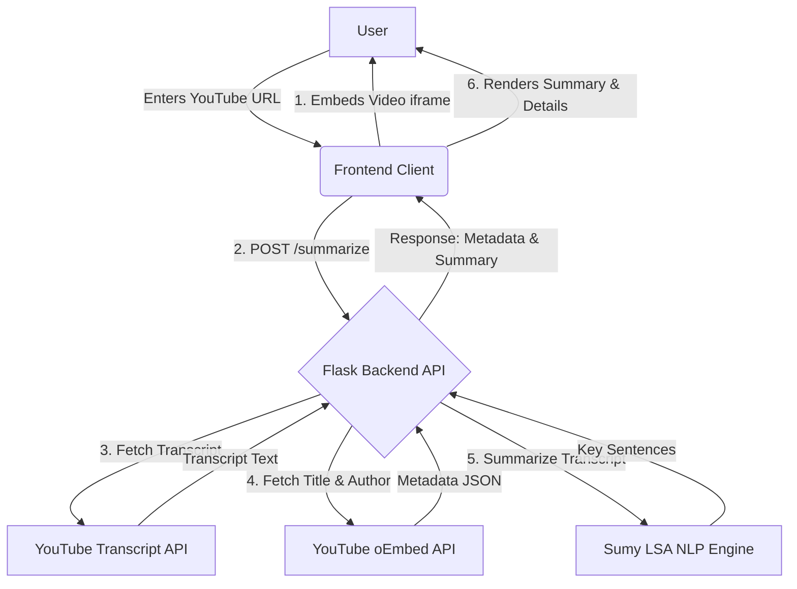

# ⚡ SPARK: Summarized Points and Rapid Knowledge

An intelligent, lightweight web application that fetches, embeds, and summarizes YouTube videos in real-time. By leveraging natural language processing (NLP), **SPARK** automatically extracts transcripts from YouTube videos and condenses them into clear, actionable summaries—saving you hours of watch time.

---

## 📌 Table of Contents

- [Key Features](#-key-features)
- [Screenshots](#-screenshots)
- [Architecture & Workflow](#-architecture--workflow)
- [Tech Stack](#-tech-stack)
- [API Reference](#-api-reference)
- [Installation & Setup](#-installation--setup)
  - [Prerequisites](#prerequisites)
  - [Backend Configuration](#backend-configuration)
  - [Frontend Configuration](#frontend-configuration)
- [How to Use](#-how-to-use)
- [Error Handling](#-error-handling)
- [Future Enhancements](#-future-enhancements)

---

## ✨ Key Features

- **Instant Embeds:** Automatically extracts the YouTube Video ID and embeds the video player directly in the UI.
- **Automated Summarization:** Utilizes Latent Semantic Analysis (LSA) to distill long transcripts into a cohesive 5-sentence summary.
- **Metadata Extraction:** Fetches key video details (such as title and channel/author name) using YouTube's oEmbed API.
- **Asynchronous Execution:** Implements beautiful dynamic loading animations to keep user experience interactive while processing.
- **Robust Exception Handling:** Gracefully handles videos with disabled or unavailable transcripts, invalid URLs, and network timeouts.

---

## 📸 Screenshots

<p align="center">
  
  
</p>
<p align="center">
  
  
</p>

---

## 🔄 Architecture & Workflow

The diagram below outlines the communication flow between the User, Frontend client, Flask Backend, and YouTube APIs:



---

## 🛠️ Tech Stack

### Frontend
- **HTML5 & CSS3:** Semantic structure and custom theme styling.
- **Bootstrap 4:** Responsive grid layout, spacing, and pre-built design components.
- **Vanilla JavaScript (ES6+):** Asynchronous fetch requests, DOM manipulation, and input validation.

### Backend
- **Python 3:** Core programming environment.
- **Flask & Flask-CORS:** Lightweight API server with Cross-Origin Resource Sharing enabled for seamless local development.
- **youtube-transcript-api:** Fetches raw transcripts directly from YouTube videos.
- **Sumy:** Natural language processing library used for text summarization via the **LsaSummarizer** algorithm.
- **Requests:** Synchronous HTTP requests for fetching video metadata from YouTube's oEmbed API.

---

## 🔌 API Reference

### 1. Health Check
Checks if the backend API service is up and running.

* **URL:** `/`
* **Method:** `GET`
* **Success Response:**
  * **Code:** `200 OK`
  * **Content:**
    ```json
    {
      "message": "YouTube Video Summarizer API is running."
    }
    ```

---

### 2. Summarize Video
Extracts transcript, details, and generates a text summary for a given YouTube URL.

* **URL:** `/summarize`
* **Method:** `POST`
* **Headers:** `Content-Type: application/json`
* **Request Body:**
  ```json
  {
    "video_url": "https://www.youtube.com/watch?v=dQw4w9WgXcQ"
  }
  ```
* **Success Response:**
  * **Code:** `200 OK`
  * **Content:**
    ```json
    {
      "summary": "This is a condensed LSA summary of the video transcript content covering all key details...",
      "video_details": {
        "title": "Rick Astley - Never Gonna Give You Up (Official Music Video)",
        "description": "Rick Astley",
        "length": "N/A"
      }
    }
    ```
* **Error Response:**
  * **Code:** `400 Bad Request`
  * **Content:**
    ```json
    {
      "error": "No transcript available for this video."
    }
    ```

---

## 🚀 Installation & Setup

### Prerequisites
Make sure you have the following installed on your machine:
- **Python 3.8+**
- **pip** (Python package installer)
- A modern web browser (Chrome, Firefox, Safari, Edge)

---

### Backend Configuration

1. **Navigate to the Backend Directory:**
   ```bash
   cd backend
   ```

2. **Create a Virtual Environment:**
   ```bash
   # On macOS/Linux:
   python3 -m venv venv

   # On Windows:
   python -m venv venv
   ```

3. **Activate the Virtual Environment:**
   ```bash
   # On macOS/Linux:
   source venv/bin/activate

   # On Windows:
   venv\Scripts\activate
   ```

4. **Install Dependencies:**
   ```bash
   pip install -r requirements.txt
   ```

5. **Start the Flask Server:**
   ```bash
   python app.py
   ```
   The backend API will start on `http://127.0.0.1:5000/` with debug mode enabled.

---

### Frontend Configuration

1. **Navigate to the Frontend Directory:**
   ```bash
   cd frontend
   ```

2. **Launch the Interface:**
   Since the frontend consists of static files, you can double-click `index.html` to open it in your browser. Alternatively, run a lightweight HTTP server:
   ```bash
   # Using Python 3
   python3 -m http.server 8000
   ```
   Now, navigate to `http://localhost:8000` in your web browser.

---

## 📖 How to Use

1. Start both the **Flask Backend Server** and the **Frontend HTTP Server**.
2. Open the **SPARK** landing page in your browser.
3. Paste a valid YouTube video URL (e.g., `https://www.youtube.com/watch?v=...`) into the input box.
4. Click **Summarize**.
5. The application will:
   - Immediately embed and load the YouTube video in the player.
   - Display a spinner while generating the summary.
   - Output the **Video Title**, **Creator/Author Name**, and the **NLP-Generated Summary** in the card below.

---

## ⚠️ Error Handling

SPARK handles typical failure cases robustly:
- **Invalid YouTube URLs:** The application screens URLs and notifies the user if a valid 11-character YouTube video ID cannot be extracted.
- **Disabled Transcripts:** If a video creator disabled captions or auto-generated transcripts are unsupported, an informative error banner is rendered.
- **Network / API Errors:** Errors interacting with the backend or oEmbed endpoints are caught and friendly feedback is displayed dynamically.

---

## 🔮 Future Enhancements

- [ ] **Custom Summary Length:** Allow users to choose short, medium, or detailed summarization levels.
- [ ] **Multi-language Support:** Add transcription translation using translation libraries or APIs.
- [ ] **Key-Point Bullets:** Provide option to view summaries as key bullet points instead of a single paragraph.
- [ ] **Export Options:** Allow users to download the summary as a `.txt` or `.pdf` file.
- [ ] **Dark Mode:** Add a sleek modern CSS theme switcher.
